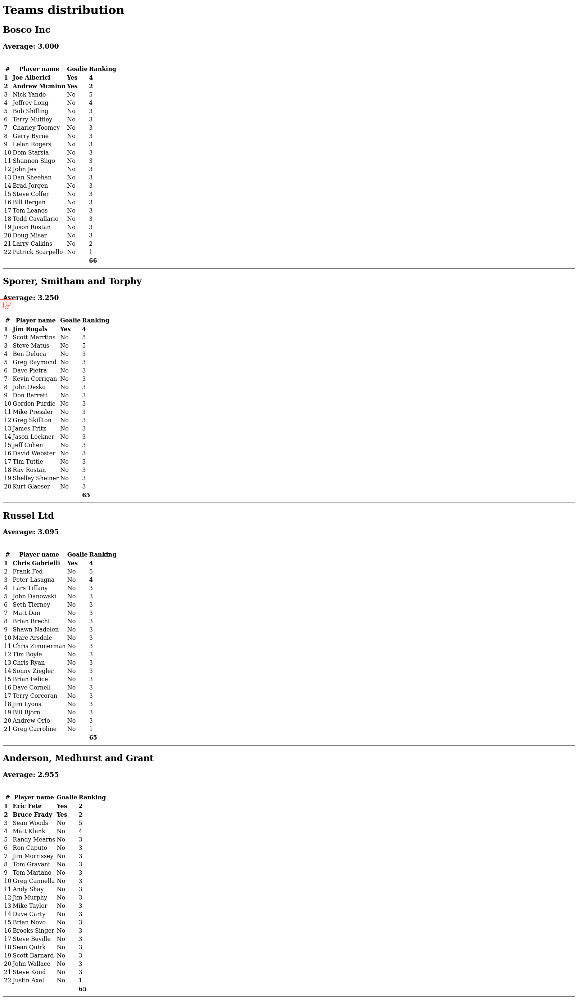

# Sports Recruits Code Challenge

### Resources

* [Working Effectively with Legacy Code by Michael Feathers](https://www.oreilly.com/library/view/working-effectively-with/0131177052/)
* [Refactoring](https://refactoring.com/)
* [POODR](https://www.poodr.com/)
* [All the Little Things](https://www.youtube.com/watch?v=8bZh5LMaSmE)

### Guiding Principles

* [Preparatory Refactoring: "Make the change easy, then make the easy change"](https://martinfowler.com/articles/preparatory-refactoring-example.html)
* [Opportunistic Refactoring](https://martinfowler.com/bliki/OpportunisticRefactoring.html)
* [Refactoring Workflows](https://martinfowler.com/articles/workflowsOfRefactoring/)

